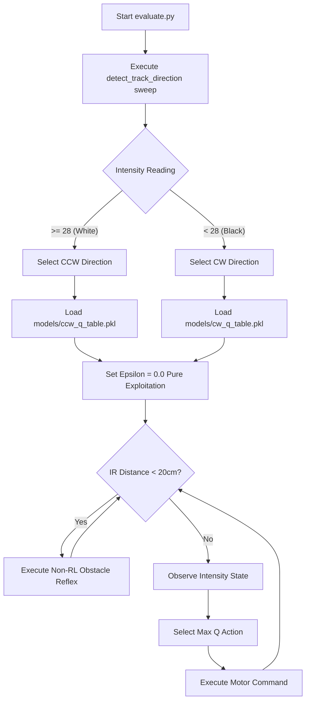

# Deployment & Running Guide

This guide details how to execute, train, and evaluate the EV3 Q-Learning path-following robot on both a PC simulator and physical LEGO Mindstorms EV3 hardware.

---

## 1. Environment Requirements

### PC Simulator Setup
- Python 3.7+ installed.
- No external packages required (uses pure standard Python libraries `random`, `pickle`, `time`, `os`, `sys`).

### EV3 Hardware Setup
- LEGO Mindstorms EV3 Brick running **EV3 MicroPython v2.0** image on microSD card.
- VS Code with **LEGO Mindstorms EV3 MicroPython Extension** installed.
- Hardware configuration:
  - **Left Motor**: Port B
  - **Right Motor**: Port C
  - **Color Sensor**: Port S1 (Reflection Mode)
  - **Infrared Sensor**: Port S4 (Distance Mode)

---

## 2. PC Simulation Mode Execution

You can run training and evaluation directly on your PC without an EV3 brick connected. The hardware abstraction layer (`RobotInterface`) will automatically detect the absence of Pybricks hardware and activate simulator mode.

### Running Training on PC
To train the Clockwise (`CW`) model:
```bash
python train.py models/cw_q_table.pkl
```

To train the Counter-Clockwise (`CCW`) model:
```bash
python train.py models/ccw_q_table.pkl
```

### Running Evaluation on PC
To run evaluation:
```bash
python evaluate.py
```

---

## 3. Physical EV3 Brick Deployment

### Method A: VS Code EV3 Extension (Recommended)
1. Turn on the EV3 brick and connect it to your PC via USB cable, Bluetooth, or Wi-Fi.
2. Open the workspace folder in VS Code.
3. Open the EV3 extension tab on the sidebar and click **Download and Run** (or press `F5`).
4. VS Code will transfer `ev3_rl_project` to the brick and execute `main.py`.

### Method B: Manual Command Line Execution via SSH
1. Connect via SSH to the EV3 brick:
   ```bash
   ssh robot@ev3dev.local
   ```
   *(Default password: `maker`)*

2. Navigate to the project directory:
   ```bash
   cd /home/robot/ev3_rl_project
   ```

3. Run training:
   ```bash
   brickman run train.py models/cw_q_table.pkl
   ```

4. Run evaluation:
   ```bash
   brickman run evaluate.py
   ```

---

## 4. Operational Workflow


