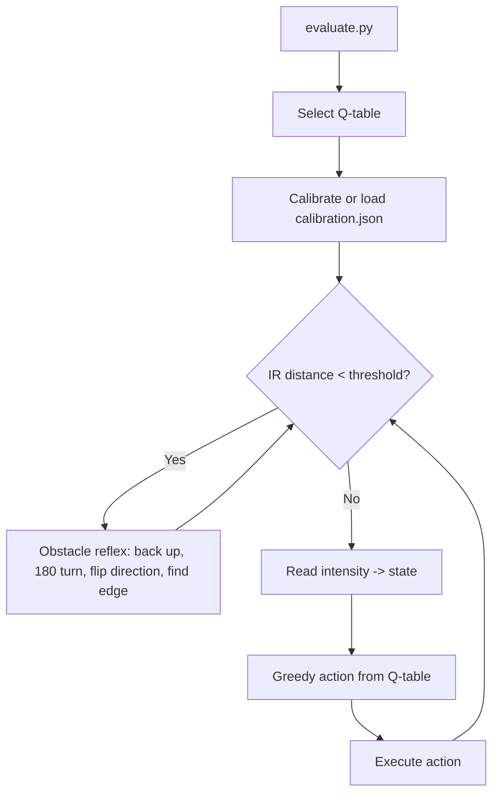

# Running Guide

## 1. Requirements

- **PC simulator:** Python 3.7+, standard library only. `RobotInterface` falls back to a simulator when Pybricks is not installed.
- **EV3 brick:** EV3 MicroPython (Pybricks) image, VS Code with the LEGO MINDSTORMS EV3 MicroPython extension.
- **Ports:** left motor B, right motor C, color sensor S1 (reflection), infrared sensor S4 (distance).

## 2. Commands

```bash
python train.py                        # saves to models/cw_q_table_8state.pkl (default)
python train.py models/my_table.pkl    # custom final save path
python evaluate.py                     # evaluation
```

On the brick, download the project with the extension and run `train.py` (training) or `main.py` (evaluation). Over SSH the project lives at `/home/robot/Q-Learning-RV3`.

To copy Q-tables and CSVs back from the brick, use `scp` (for example `scp -r robot@ev3dev.local:/home/robot/Q-Learning-RV3/models/* models/`).

## 3. Calibration (every run)

Both `train.py` and `evaluate.py` start with sensor calibration.

- **CENTER:** measure pure white, pure black, then the edge (place the sensor, press CENTER for each). Thresholds are computed, applied, and saved to `models/calibration.json`. Press CENTER again to confirm and start.
- **DOWN:** skip and load `models/calibration.json`.
- Abnormal readings (not white > edge > black) also fall back to the saved file.
- The simulator skips calibration and loads the saved file.

## 4. Training

Training is interactive and runs in two phases (see CODE_EXPLANATION.md section 6).

If `models/straight_q_table_8state.pkl` exists you are asked: **UP / `1`** start fresh, or **RIGHT / `2`** load the checkpoint and go straight to the turn phase.

Each episode:

1. Place the robot on the line and press **CENTER** (Enter in the simulator).
2. After the episode: **UP / `1`** keep and run the next episode, **LEFT / `2`** discard this episode and redo it, **DOWN / `3`** keep, save, and finish the phase.
3. After the straight phase: **UP / `1`** continue to the turn phase, **DOWN / `2`** stop here.
4. After the turn phase, the save menu: **UP / `1`** default path, **RIGHT / `2`** date-stamped file, **DOWN / `3`** discard.

**Training the Lost row (state 7):** it only trains if the robot stays on Pure Black for `LOST_TIME_MS` (2 s), which the agent usually avoids by steering back. In the turn phase, run a few episodes with the robot placed at least 15 cm onto black. A warning is printed at the end of the turn phase if row 7 is still untrained.

Outputs: the Q-table (`.pkl`) and `training_metrics_phased.csv` (per-episode updates, reward, off-phase steps, lost steps, epsilon).

## 5. Evaluation

1. Choose a Q-table from `models/`: UP/DOWN browse, CENTER select, LEFT twice to delete (simulator: type a number, or `d<number>` to delete).
2. Calibrate (section 3).
3. If calibration ran, the robot starts right away after confirmation. If you skipped it, press CENTER to start.
4. The robot follows the line with epsilon = 0. The IR sensor triggers the obstacle reflex. Ctrl+C (or stopping the program on the brick) stops the motors.

If the selected Q-table cannot be loaded, evaluation aborts.

## 6. Flow


```mermaid
flowchart TD
    A[evaluate.py] --> B[Select Q-table]
    B --> C[Calibrate or load calibration.json]
    C --> D{IR distance < threshold?}
    D -- Yes --> E[Obstacle reflex: back up, 180 turn, flip direction, find edge]
    E --> D
    D -- No --> F[Read intensity -> state]
    F --> G[Greedy action from Q-table]
    G --> H[Execute action]
    H --> D
```
