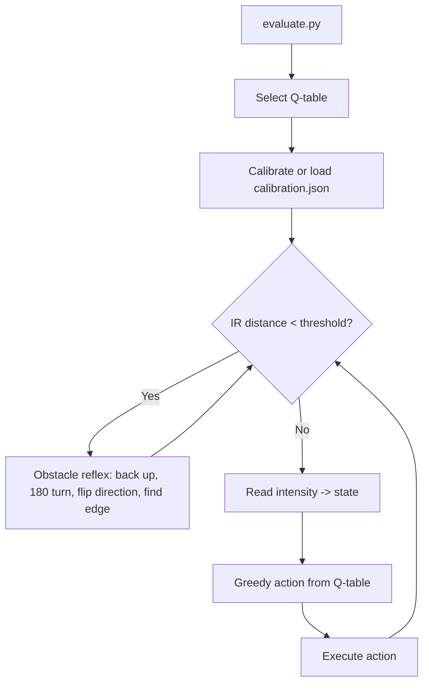

# Running Guide

## 1. Requirements

- **PC simulator:** Python 3.7+, standard library only. `RobotInterface` falls back to a simulator when Pybricks is not installed.
- **EV3 brick:** EV3 MicroPython (Pybricks) image, VS Code with the LEGO MINDSTORMS EV3 MicroPython extension.
- **Ports:** left motor B, right motor C, color sensor S1 (reflection), infrared sensor S4 (distance).

## 2. Commands

```bash
python train.py                        # saves to models/cw_q_table_8state.pkl (default)
python train.py models/my_table.pkl    # custom final save path
python evaluate.py                     # evaluation
```

On the brick, download the project with the extension and run `train.py` (training) or `main.py` (evaluation). Over SSH the project lives at `/home/robot/Q-Learning-RV3`.

To copy Q-tables and CSVs back from the brick, use `scp` (for example `scp -r robot@ev3dev.local:/home/robot/Q-Learning-RV3/models/* models/`).

## 3. Calibration (every run)

Both `train.py` and `evaluate.py` start with sensor calibration.

- **CENTER:** measure pure white, pure black, then the edge (place the sensor, press CENTER for each). Thresholds are computed, applied, and saved to `models/calibration.json`. Press CENTER again to confirm and start.
- **DOWN:** skip and load `models/calibration.json`.
- Abnormal readings (not white > edge > black) also fall back to the saved file.
- The simulator skips calibration and loads the saved file.

## 4. Training

Flat training from the heuristic table: 100 episodes of 100 steps, all 64 cells can be updated (see CODE_EXPLANATION.md section 6).

If a saved table exists you are asked first: **UP / `1`** continue training it, or **DOWN / `2`** restart from the heuristic table.

The robot keeps driving through the episodes, so place it on the line once at the start. For each episode the direction is reset to the start configuration, and an obstacle triggers the reflex (no learning during it).

When the episodes finish:

1. Save menu: **UP / `1`** default path, **RIGHT / `2`** date-stamped file, **DOWN / `3`** discard.
2. Continue menu: **UP / `1`** train another session, **DOWN / `2`** stop.
3. If you continue: **UP / `1`** keep training the same table, **DOWN / `2`** start a new table (fresh heuristic start, saved under a date-stamped name).

Outputs: the Q-table (`.pkl`) and `training_metrics_cw_8state.csv` (episode, hard corrections, lap completed, total reward).

**Using the table on the `phased-training` branch:** the table has the same 8 x 8 layout, so copy the `.pkl` into that branch's `models/` folder and select it in evaluation. It is not a phased table, so every state may use any action.

## 5. Evaluation

1. Choose a Q-table from `models/`: UP/DOWN browse, CENTER select, LEFT twice to delete (simulator: type a number, or `d<number>` to delete).
2. Calibrate (section 3).
3. If calibration ran, the robot starts right away after confirmation. If you skipped it, press CENTER to start.
4. The robot follows the line with epsilon = 0. The IR sensor triggers the obstacle reflex. Ctrl+C (or stopping the program on the brick) stops the motors.

If the selected Q-table cannot be loaded, evaluation falls back to the heuristic table.

## 6. Flow


```mermaid
flowchart TD
    A[evaluate.py] --> B[Select Q-table]
    B --> C[Calibrate or load calibration.json]
    C --> D{IR distance < threshold?}
    D -- Yes --> E[Obstacle reflex: back up, 180 turn, flip direction, find edge]
    E --> D
    D -- No --> F[Read intensity -> state]
    F --> G[Greedy action from Q-table]
    G --> H[Execute action]
    H --> D
```
